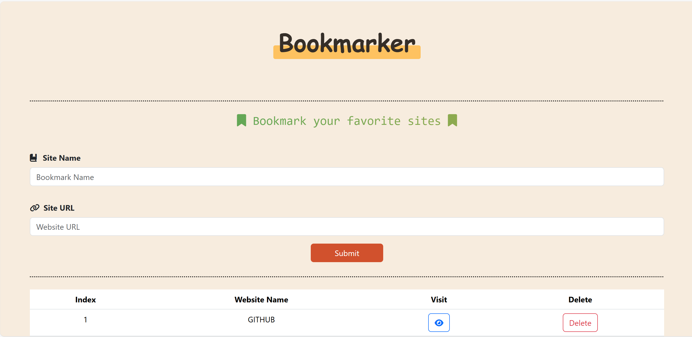

# 🔖 Bookmarker App

A simple and responsive **Bookmark Manager** built using **HTML, CSS, Bootstrap, and Vanilla JavaScript**.  
This project allows users to save their favorite websites, validate inputs, display toast notifications, and store data permanently using Local Storage.

---

## 📸 Screenshot



---

## 🚀 Live Demo

> Add your live demo link here after deployment

---

## 🛠 Technologies Used

- HTML5
- CSS3
- Bootstrap 5
- JavaScript (Vanilla JS)
- Font Awesome
- SweetAlert2
- Local Storage API

---

## ✨ Features

- Add website bookmarks
- Real-time form validation
- Error messages shown under inputs
- Errors disappear when user starts typing
- Toast notifications for success and errors
- Visit websites in a new tab
- Delete saved bookmarks
- Persistent data using Local Storage
- Responsive UI for all screen sizes

---

## 🧠 Validation Rules

- **Site Name**

  - Minimum 3 characters
  - Letters and spaces only

- **Site URL**
  - Must be a valid URL
  - Supports http / https

---

## 📂 Project Structure

```
Bookmarker-App/
│
├── index.html
├── css/
│   ├── bootstrap.min.css
│   ├── all.min.css
│   └── style.css
│
├── js/
│   ├── bootstrap.bundle.min.js
│   └── index.js
│
├── screenshot.png
└── README.md
```

---

## ⭐ Why This Project?

This project demonstrates:

- DOM manipulation
- Form validation logic
- Working with Local Storage
- Clean and readable JavaScript code
- UI/UX best practices

---

## 👨‍💻 Author

**Your Name**  
GitHub: https://github.com/mo-yes

---

## 📄 License

This project is open-source and available under the **MIT License**.
